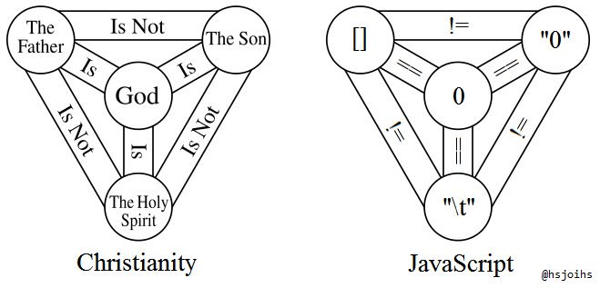
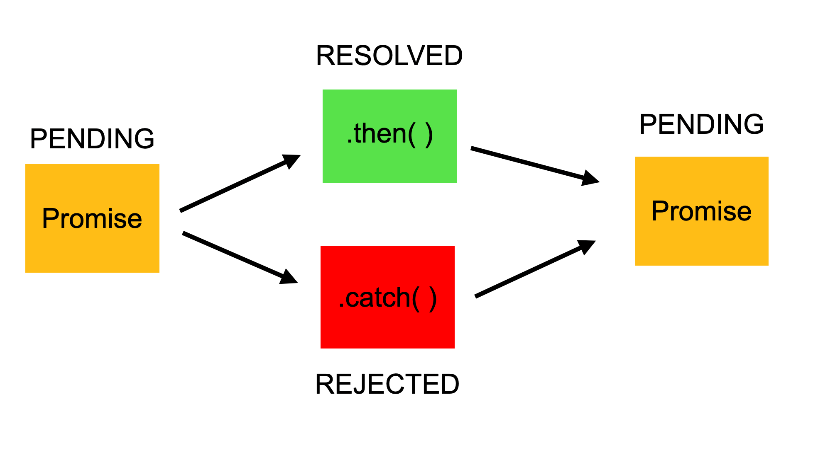

# JavaScript Fundamentals

Bu ders, JavaScript'in temel konularını ele alarak, Express.js ve React.js gibi modern kütüphanelerle çalışacak öğrenciler için sağlam bir temel oluşturmayı amaçlar.

---

## 1. Veri Tipleri (Data Types)

JavaScript'te veri tipleri ikiye ayrılır: **Primitive** ve **Reference**.

### Primitive Data Types

```js
let message = "Hello"; // String
let age = 42; // Number
let isStudent = true; // Boolean
let lectures = null; // Null
let undefinedVar; // Undefined
```

### Reference Data Types

```js
let numbers = [1, 2, 3]; // Array
let human = { name: "Alice", age: 25 }; // Object
let greet = function () {
  console.log("Hello World");
}; // Function
```

---

## 2. var, let, const Farklılıkları

- **var** function scope'a sahiptir, değiştirilebilir ve yeniden atanabilir.
- **let** block scope'a sahiptir, değiştirilebilir ama yeniden atanamaz
- **const** block scope'a sahiptir, değiştirilemez ve yeniden atanamaz.

```js
function varGreet() {
  var message = "Hello World";
  if (true) {
    var message = "Hello Universe";
  }
  console.log(message); // "Hello Universe"
}

function letGreet() {
  // same with const
  let message = "Hello World";
  if (true) {
    let message = "Hello Universe";
  }
  console.log(message); // "Hello World"
}
```

---

## 3. == vs === Operatörleri

- `==` (Abstract Equality): Tür dönüşümü yaparak sadece değerleri kıyaslar.
- `===` (Strict Equality): Hem değer hem de tür açısından kıyaslar.

```js
console.log("1" == 1); //true
console.log(3 == [3]); //true
console.log(3 == 3); //true
console.log(3 == "3"); //true
console.log(1 == true); //true
console.log("" == 0); //true

console.log("1" === 1); //false
// console.log(3===[3]); //false
console.log(3 === 3); //true
console.log(1 === true); //false
console.log("" === 0); //false
```



---

## 4. Hoisting

### Function Hoisting

```js
hoistFunction();
function hoistFunction() {
  console.log("Function has been hoisted");
}
```

### Variable Hoisting

```js
console.log(hoistVar); // undefined

var hoistVar = "Variable has been hoisted";
s;
console.log(hoistVar); // "Variable has been hoisted"
```

---

## 5. Regular vs Arrow Functions & Anonymous Functions

- Anonim fonksiyonlar kısaca isimsiz fonksiyonlardır, bir değişkene atanabilir veya bir fonksiyona parametre olarak gönderilebilir. Callback'lerde kullanılır.

- Tüm arrow function'lar anonimdir ve obje tabanlı değilerdir.

```js
// Regular Function || Based on objects (prototypes)
function regularSum(a, b) {
  return a + b;
}

// Arrow Function || Not an object.
const arrowSum = (a, b) => a + b;

console.log(regularSum(1, 2)); // 3
console.log(arrowSum(1, 2)); // 3

//Anonymous Functions
// Regular Function
const regularGreet = function () {
  console.log("Hello World");
};

// Arrow Function

const arrowGreet = () => {
  console.log("Hello World");
};
```

---

## 6. Array Methods

### forEach

```js
const numbers = [1, 2, 3, 4, 5];
numbers.forEach((number) => {
  console.log(number);
});
```

### map

```js
const doubled = numbers.map((number) => number * 2);
console.log(doubled); //[2, 4, 6, 8, 10]
```

### filter

```js
const evenNumbers = numbers.filter((number) => number % 2 === 0);
console.log(evenNumbers); //[2, 4]
```

### reduce

```js
const sum = numbers.reduce((acc, number) => acc + number, 0);
console.log(sum);
```

---

## 7. Asenkron Programlama

- JavaScript’te asenkron programlama, kodun sıralı bir şekilde çalışmasının (senkron) yerine, belirli işlemlerin zamanla tamamlanmasını beklemeden ilerleyebilmesini sağlar. Asenkron programlama, özellikle IO-bound (giriş/çıkış işlemleri) veya zaman alan işlemler (veritabanı sorguları, API istekleri, dosya okuma/yazma gibi) için kritik öneme sahiptir.

### setTimeout

- Verilen işlemi istenen milisaniye kadar geciktiren bir araç

```js
console.log("Hi there!");

setTimeout(() => {
  console.log("I'm gonna be late...");
}, 2000);

console.log("I'm on time!");
```

### Callbacks

```js
function sayHello(callback) {
  console.log("Hello");
  callback();
}

function sayWassup() {
  console.log("Wassup?");
}

function sayBye() {
  console.log("bye.");
}

sayHello(sayBye);
```

```js
function sumNumbers(a, b, callback) {
  const sum = a + b;
  callback(sum);
}

function print(sum) {
  console.log(sum);
}

function printExcited(sum) {
  console.log("OMG!!! sum is " + sum + "!");
}

sumNumbers(1, 2, print);

sumNumbers(1, 2, printExcited);
```

### Promises



```js
const p = new Promise((resolve, reject) => {
  let a = 1 + 1;
  if (a === 2) {
    resolve("Success");
  } else {
    reject("Failed");
  }
});

p.then(
  (message) => console.log("This is in the then: " + message),
  (error) => console.log("This is in the catch: " + error)
);
```

### Async/Await

```js
function giveVideo() {
  return new Promise((resolve) => {
    setTimeout(() => {
      resolve("Al sana video");
    }, 2000);
  });
}

async function displayVideo() {
  const video = await giveVideo();
  console.log(video);
}

displayVideo();
```

---

## 8. Try-Catch Blokları

```js
async function fetchData() {
  return new Promise((resolve, reject) => {
    setTimeout(() => {
      const error = false;
      if (!error) {
        console.log("Data Fetched");
        resolve(["Elma", "Armut", "Muz"]);
      } else {
        reject("Data Fetching Error");
      }
    }, 2000);
  });
}

async function displayData() {
  try {
    const data = await fetchData();
    console.log(data);
  } catch (error) {
    console.log("An error occurred: ", error);
  } finally {
    console.log("Finally, it's done...");
  }
}

displayData();
```

---

Bu içerik, JavaScript'in temel kavramlarını anlamanızı sağlayarak, Express.js ve React.js ile çalışmanızı kolaylaştıracaktır. 🚀
