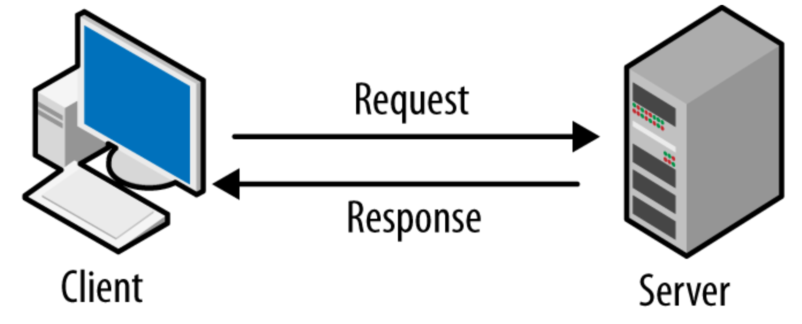
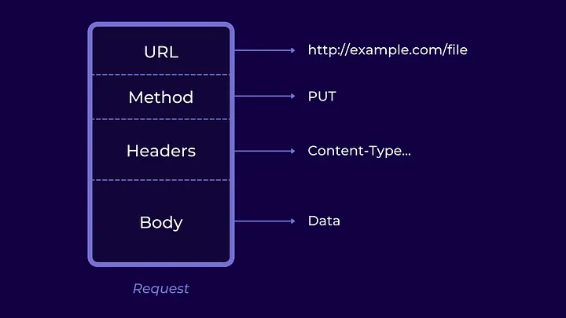
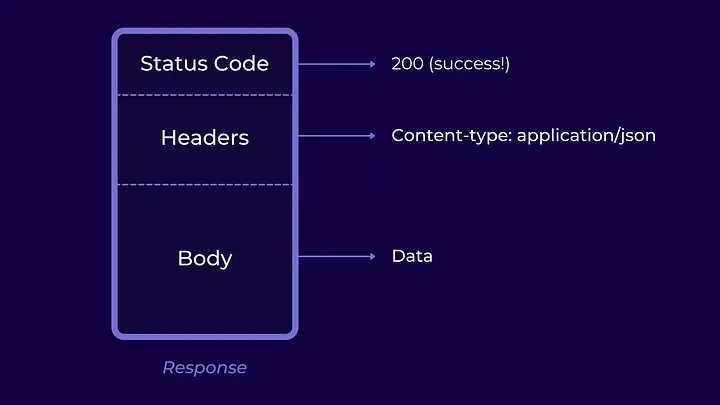
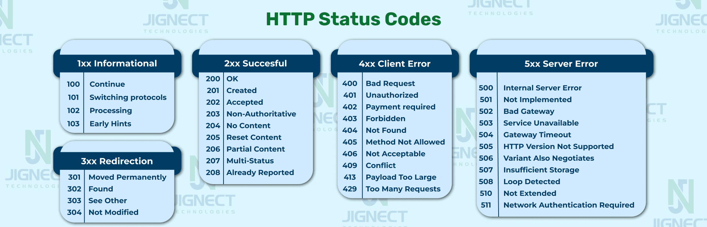

# 📘 DevTeam Bootcamp - Ders 2

## 02 - HTTP, RestAPI, Express.js - Arca

---

## 1. Client - Server Mantığı

Web dünyasında her şeyin temelinde **client (istemci)** ve **server (sunucu)** vardır.

- **Client (İstemci):** Kullanıcının elinde olan cihazdır (tarayıcı, mobil uygulama vb.). Kullanıcı bir işlem yapmak istediğinde (örneğin Google’da arama yapmak), bu cihaz bir istek gönderir.
- **Server (Sunucu):** İstekleri karşılayan ve gerekli işlemleri yapan taraftır. İçerisinde veritabanı, iş kuralları ve işleyiş mantığı bulunur. Sunucu, gelen isteğe uygun cevabı üretip istemciye geri gönderir.

**Özetle:** Client → İstek (Request) gönderir. Server → Yanıt (Response) döner. Bu iletişim web’in temelini oluşturur.



---

## 2. HTTP Protokolü

İstemci ile sunucu birbirleriyle **HTTP (HyperText Transfer Protocol)** aracılığıyla haberleşir. Yani bu ikili arasındaki ortak dil, HTTP’dir.

### HTTP’nin Özellikleri

- **Metin tabanlı** bir protokoldür. Yani mesajlar okunabilir bir şekilde gönderilir.
- **Stateless (Durumsuz)** çalışır. Her istek bağımsızdır, sunucu önceki istekleri hatırlamaz.
- **Request - Response** mantığı üzerine kuruludur.

### Request (İstek) Yapısı

Bir HTTP isteği şu üç bölümden oluşur:

1. **Request Line**: Method (GET, POST…), URL ve HTTP versiyonu.
2. **Headers**: İstek hakkında meta bilgiler (örneğin, içerik tipi, yetkilendirme bilgisi).
3. **Body**: İstekle beraber gönderilen veriler (örn: bir form veya JSON). Yalnızca POST, PUT gibi methodlarda bulunur.



### Response (Yanıt) Yapısı

Sunucunun döndüğü HTTP yanıtı da üç bölümden oluşur:

1. **Status Line**: HTTP versiyonu, status code ve status text.
2. **Headers**: Yanıtın meta bilgileri (örn: dönen içeriğin tipi, uzunluğu).
3. **Body**: Sunucunun döndürdüğü asıl veri (örn: HTML, JSON).



### Status Codes

Sunucu, isteğin sonucunu **status code** ile bildirir:

- 200 → OK (başarılı)
- 201 → Created (yeni kaynak oluşturuldu)
- 400 → Bad Request (yanlış istek)
- 404 → Not Found (kaynak bulunamadı)
- 500 → Internal Server Error (sunucu hatası)



---

## 3. REST API

HTTP’nin üzerine inşa edilen en yaygın mimarilerden biri **REST API**’dir. REST, “Representational State Transfer” anlamına gelir.

- **API:** Application Programming Interface. Bir yazılımın başka bir yazılımla nasıl konuşacağını tanımlayan kurallar bütünüdür.

### REST API Mimarisinin Özellikleri

- **Kaynak (Resource) temelli:** Her şey bir kaynak olarak görülür (örneğin `users`, `todos`).
- **Endpoint kullanımı:** Kaynaklara erişmek için URL yapıları kullanılır.
  - Örnek: `/api/todos`, `/api/users`
- **Metodların Anlamları:**
  - GET → İstenen kaynakları listeleme / getirme.
  - POST → Sunucuda yeni kaynakların oluşturulmasını sağlama (Veritabanı sütunu, çeşitli tokenlar vs.).
  - PUT → Var olan bir kaynağın silinip yerine yenisinin konmasını sağlama.
  - PATCH → Var olan bir kaynağın üzerinde değişiklik yapılmasını sağlama.
  - DELETE → İstenen kaynakların silinmesini sağlama.
- **Stateless:**
  - REST’in stateless olması server’ın client hakkında session gibi bilgileri tutmaması demektir. Bu gibi bilgileri yalnızca client tutar. Dolayısıyla server, istek yapan client’ın daha önce kaç istek yaptığı veya hangi istekleri yaptığı gibi bilgileri tutmaz. Client ise yaptığı istekte server’ın ihtiyaç duyduğu tüm bilgileri verir. (🤔)
- **JSON Yanıtları:** Çoğunlukla veri JSON formatında döner.
- **Uniform Interface:**

  - Aynı kaynak için tüm API istekleri, isteğin nereden geldiğine bakılmaksızın aynı URL üzerinden gerçekleştirilmelidir.
  - Kaynak üzerinde yapılacak işlemler metodlarla spesifike edilir.

- **RestAPI örneği:**
  - GET /api/users : Kullanıcı verisini getir.
  - POST /api/users : Kullanıcı ekle.
  - GET /api/todos/:id : Bu id'ye sahip kullanıcıyı getir.
  - PUT /api/todos/:id : Bu kullanıcıyı yeni verilerle replace et.
  - PATCH /api/todos/:id : Bu kullanıcıyı düzenle.
  - DELETE /api/todos/:id : Bu kullanıcıyı sil.

---

## 4. Express.js ile Uygulama

Artık teoriyi bitirip uygulamaya geçiyoruz. Express.js kullanarak kendi REST API’mizi geliştireceğiz.

### Node.js ve Express Kurulumu

```bash
npm init -y
npm install express
```

### İlk Server

```js
const express = require("express");
const app = express();
const PORT = 3000;

app.get("/", (req, res) => {
  res.send("Merhaba Express!");
});

app.listen(PORT, () => console.log(`Server ${PORT} portunda çalışıyor`));
```

---

## 5. Mini Proje: In-Memory Todo API

Bu projede, bellek üzerinde çalışan (veritabanı olmadan) bir yapılacaklar listesi API’si geliştireceğiz.

### Setup

```js
const express = require("express");
const app = express();
app.use(express.json());

let todos = [];

app.listen(3000, () => console.log("API running on http://localhost:3000"));
```

### GET & POST

```js
app.get("/todos", (req, res) => {
  res.json(todos);
});

app.post("/todos", (req, res) => {
  const newTodo = { id: Date.now(), text: req.body.text };
  todos.push(newTodo);
  res.status(201).json(newTodo);
});
```

### PUT

```js
app.put("/todos/:id", (req, res) => {
  const id = parseInt(req.params.id);
  const todo = todos.find((t) => t.id === id);
  if (!todo) return res.status(404).json({ error: "Todo not found" });
  todo.text = req.body.text;
  res.json(todo);
});
```

### DELETE

```js
app.delete("/todos/:id", (req, res) => {
  const id = parseInt(req.params.id);
  todos = todos.filter((t) => t.id !== id);
  res.status(204).send();
});
```

---

## 🎯 Özet

- Web’in temelinde client-server ilişkisi vardır.
- İletişim HTTP protokolü ile gerçekleşir.
- REST API, HTTP üzerinde CRUD işlemlerini standartlaştırır.
- Express.js sayesinde hızlıca kendi REST API’mizi geliştirebiliriz.
- Mini proje ile CRUD mantığını uygulayarak pratik yaptık.
