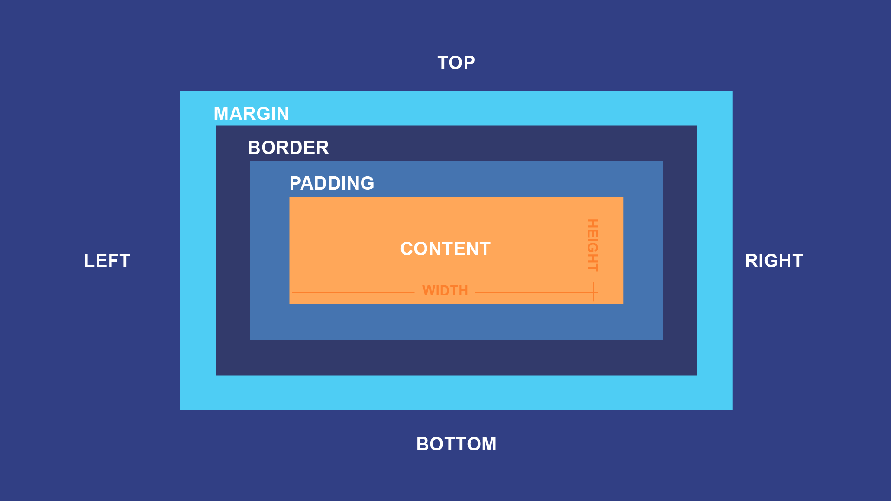

# React Temelleri - Ders Notları

## ⚛️ React Nedir?

- **React**, kullanıcı arayüzleri (UI) oluşturmak için kullanılan bir **JavaScript kütüphanesidir**.
- Facebook tarafından geliştirilmiştir ve günümüzde en popüler frontend teknolojilerinden biridir.
- Tek sayfa uygulamaları (SPA) geliştirmeyi kolaylaştırır.

### React'in Temel Özellikleri

## 1. Component Mimarisi

- Uygulama, küçük ve tekrar kullanılabilir parçalara (component) ayrılır.
- Her component, kendi yapısı ve işleviyle bağımsızdır.
- Tek bir HTML/JS dosyası büyüdükçe yönetmesi zor hale gelir.
- React sayfayı küçük, tekrar kullanılabilir parçalara ayırır.
- Örnek component'ler: `Navbar`, `HomePage`, `Footer`.

### Props

- Dışarıdan component'e gönderilen verilerdir.
- Fonksiyon parametresine benzer.
- Tek yönlü veri akışı sağlar (parent → child).

**Örnek:**

```jsx
function UserCard({ name, age }) {
  return (
    <p>
      {name} - {age}
    </p>
  );
}

<UserCard name="Farhad" age={25} />;
```

---

## 2. State Management

### State Nedir?

- Component'in kendi içinde sakladığı, değişebilen verilerdir.
- Kullanıcı etkileşimine göre güncellenebilir.

### Props vs State

- **Props**: Dışarıdan gelir, değiştirilemez.
- **State**: İçeride tutulur, değişebilir.

**Örnek: Sayaç**

```jsx
function Counter() {
  const [count, setCount] = useState(0);

  return (
    <div>
      <p>Count: {count}</p>
      <button onClick={() => setCount(count + 1)}>+</button>
      <button onClick={() => setCount(count - 1)}>-</button>
    </div>
  );
}
```

---

## 3. Event Handling

- Kullanıcı etkileşimlerini yönetmek için event'ler kullanılır.
- Örnek event'ler: `onClick`, `onChange`, `onSubmit`.

**Örnek: Input kontrolü**

```jsx
function Counter() {
  const [count, setCount] = useState(0);

  return (
    <div>
      <p>Count: {count}</p>
      <button onClick={() => setCount(count + 1)}>+</button>
      <button onClick={() => setCount(count - 1)}>-</button>
    </div>
  );
}
```

---

## 4. useEffect ile Veri Çekme

- Component render edildiğinde veya belirli durumlarda yan etkiler oluşturmak için kullanılır.
- Örnek: API'den veri çekmek.

**Örnek:**

```jsx
function PostList() {
  const [posts, setPosts] = React.useState([]);
  const [loading, setLoading] = React.useState(true);
  const [error, setError] = React.useState(null);

  React.useEffect(() => {
    fetch("https://jsonplaceholder.typicode.com/posts")
      .then((res) => res.json())
      .then((data) => {
        setPosts(data);
        setLoading(false);
      })
      .catch(() => {
        setError("Veri alınamadı!");
        setLoading(false);
      });
  }, []);

  if (loading) return <p>Loading...</p>;
  if (error) return <p>{error}</p>;

  return (
    <ul>
      {posts.map((post) => (
        <li key={post.id}>{post.title}</li>
      ))}
    </ul>
  );
}
```

---

## 5. Routing (react-router-dom)

- React tek sayfa uygulamalarında kullanılır ama sayfa geçişi için özel bir kütüphaneye ihtiyaç vardır.
- **react-router-dom**, en popüler routing çözümüdür.

### Router Object ile Kullanım (createBrowserRouter)

```jsx
import { createBrowserRouter, RouterProvider } from "react-router-dom";

function Home() {
  return <h2>Home Page</h2>;
}

function About() {
  return <h2>About Page</h2>;
}

const router = createBrowserRouter([
  {
    path: "/",
    element: <Home />,
  },
  {
    path: "/about",
    element: <About />,
  },
]);

export default function App() {
  return <RouterProvider router={router} />;
}
```

👉 Bu yapıda:

- Route’lar merkezi bir `router` objesinde tanımlanır.
- `RouterProvider` ile uygulamaya bağlanır.
- Daha okunabilir ve büyük projelerde yönetimi kolaydır.

---

## 6. Flexbox

- React projelerinde CSS kullanırken **flexbox**, elemanları düzenlemek için çok kullanışlıdır.
- Özellikle component’leri yatay/dikey hizalamak için tercih edilir.

**Örnek:**

```jsx
function FlexExample() {
  return (
    <div
      style={{
        display: "flex",
        justifyContent: "space-between",
        alignItems: "center",
      }}
    >
      <div style={{ background: "lightblue", padding: "10px" }}>Sol</div>
      <div style={{ background: "lightgreen", padding: "10px" }}>Orta</div>
      <div style={{ background: "lightcoral", padding: "10px" }}>Sağ</div>
    </div>
  );
}
```

👉 `display: flex` → Flex container oluşturur.
👉 `justifyContent` → Yatay hizalama (başlangıç, bitiş, ortalama, eşit dağıtma).
👉 `alignItems` → Dikey hizalama.

---

## 7. Box Model

- **Box Model**, her HTML elementinin çevresindeki alanları tanımlar.
- 4 ana bölümden oluşur:
  1. **Content**: Asıl içerik (metin, resim, vb.)
  2. **Padding**: İçerik ile kenarlık arasındaki boşluk
  3. **Border**: Kenarlık
  4. **Margin**: Elementin dışındaki boşluk

**Örnek:**

```html
<div
  style="
  width: 200px;
  padding: 20px;
  border: 5px solid blue;
  margin: 15px;
  background: lightgray;
"
>
  Kutu
</div>
```



---

## CSS Ölçü Birimleri (px, %, em, rem, vw, vh)

Modern arayüzlerde responsive (duyarlı) tasarım için doğru birim seçimi kritik önemdedir.

### px (piksel)

- Ekrandaki **fiziksel pikselden bağımsız** mantıksal bir ölçüdür (CSS px).
- Kesin ölçü gerektiğinde kullanılır (örn. `1px border`).
- **Dezavantaj:** Kullanıcı font büyütme/erişilebilirlik ayarlarına duyarsız kalabilir.

### % (yüzde)

- Değeri **ebeveyn (parent)** elementin ilgili boyutuna göre hesaplanır.
  - `width: 50%` → parent’ın genişliğinin yarısı.
  - `height: %` → çoğu durumda parent’ın **explicit height**’ına göre çalışır.
- **Kullanım:** Akışkan genişlikler, kolonlar.

### em

- Değer, **geçerli font-size**’a göredir (kendi ya da en yakın parent).
  - Parent `font-size: 16px` ise `1em = 16px`.
- **Kullanım:** Bileşen içi **spacing** (padding/margin) ve **tipografiyle orantılı** öğeler.
- **Dikkat:** İç içe em kullanımı **çarpan etkisi** (nesting) yapar; beklenmedik büyümeler olabilir.

### rem (root em)

- Değer, **root (`html`) font-size**’ına göredir.
  - Varsayılan genelde `16px` → `1rem = 16px`.
- **Kullanım:** Tutarlı, erişilebilir tipografi ve spacing.
- **Avantaj:** İç içe yapıdan **etkilenmez**; tasarım sistemleri için idealdir.

### vw / vh (viewport width/height)

- **Viewport**’un genişliği/yüksekliğine göre hesaplanır.
  - `1vw = viewport genişliğinin %1`
  - `1vh = viewport yüksekliğinin %1`

## 📌 Özet

- **Component**: UI’nin parçaları
- **Props**: Dışarıdan gelen veri
- **State**: İçeride yönetilen, değişebilen veri
- **Event handling**: Kullanıcı etkileşimini yönetmek
- **useEffect**: API çağrıları gibi yan etkileri yönetmek
- **Routing**: Farklı sayfalara ayrılmış component yapısı
- **Flexbox**: Component'leri hizalamak ve düzenlemek için güçlü bir CSS aracı
